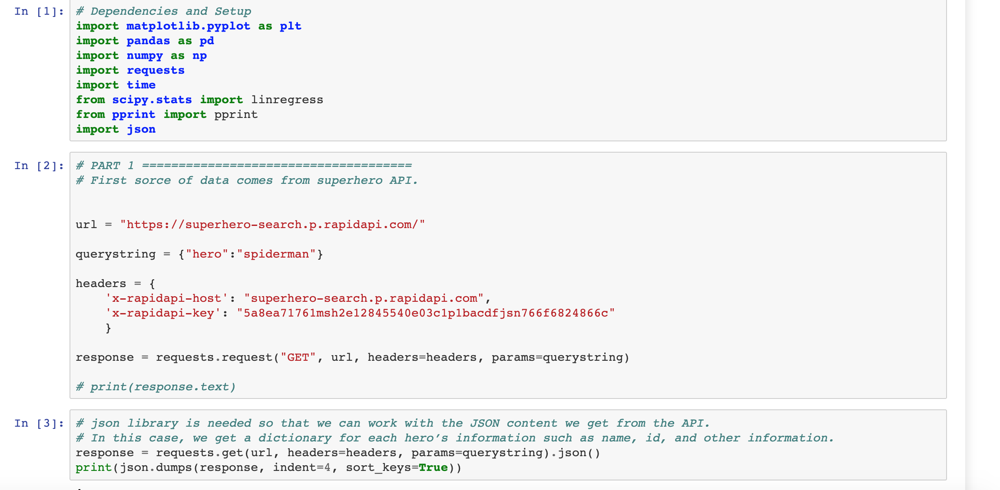
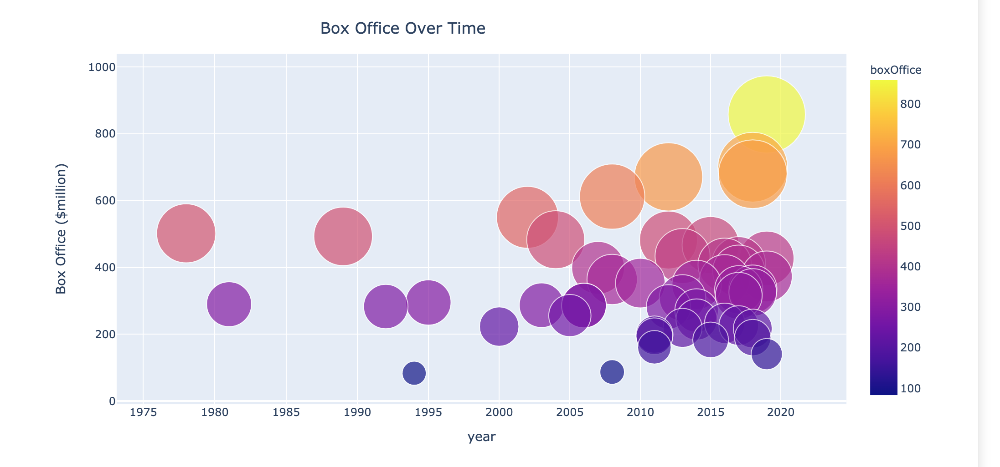
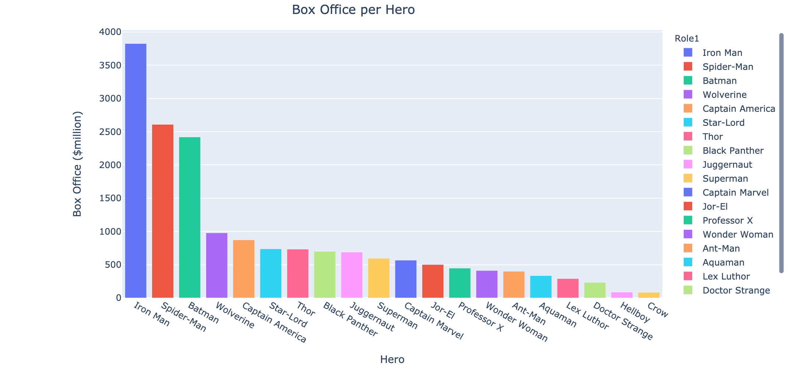
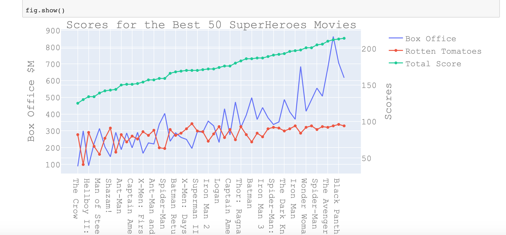

# Flask_app with Jupyter Notebook HTML version

ETL is a type of data integration that refers to the three steps (extract, transform, load) used to blend data from multiple sources. It's often used to build a data warehouse. During this process, data is taken (extracted) from a source system, converted (transformed) into a format that can be analyzed, and stored (loaded) into a data warehouse or other system. Extract, load, transform (ELT) is an alternate but related approach designed to push processing down to the database for improved performance.

ETL Project - The Best 50 SuperHero Movies of All Type and their SuperHeroes. (data was collected in March, 2020)

Project Proposal - To create a data set that will united Best 50 SuperHero Movies info with movie's SuperHero info.

Extract Data - I - there are four sources of data that I extracted from:

     1. superhero API (to get SuperHeroes info)
     2. data scraped from the web (to ger best 50 SuperHeroes Movies)
     3. omdb API (to get detail info about best 50 SuperHeroes movies)
     4. python package - IMDbPY (to get info about main Actor and the main Role(SuperHero))

II - there are four ways how the data was formatted: 1. CSV 2. XLSX 3. pgAdmin 4. HTML

Transform Data - the type of transformation needed for this data:

      1. cleaning
      2. joining
      3. filtering
      4. aggregating (groupby, sort, average, count)
      5. deleting columns
      6. data visualization

7.  data virtualization (created a Flask Application). Get the Best 50 SuperHero Movies , connected each movie to the SuperHero and displayed them next to each other in the app.

8. Deployed my App to Heroku : https://etl-project-super-heroes.herokuapp.com/

   Jupyter Notebook HTML version with whole ETL process available under link ETL-Project(Jupyter Notebook) in the App navigation bar .

