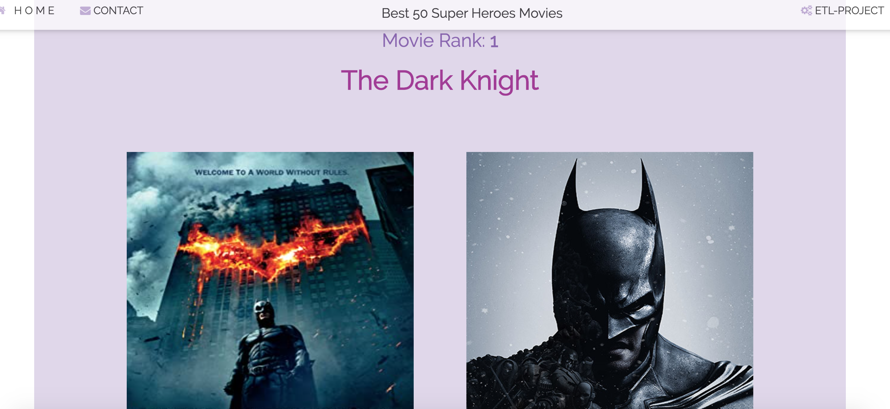

# Flask App with Jupyter Notebook HTML version

ETL Project - The Best 50 Superhero Movies

ETL is a type of data integration that refers to the three steps (extract, transform, load) used to blend data from multiple sources. It's often used to build a data warehouse. During this process, data is taken (extracted) from a source system, converted (transformed) into a format that can be analyzed, and stored (loaded) into a data warehouse or other system. Extract, load, transform (ELT) is an alternate but related approach designed to push processing down to the database for improved performance.

Project Proposal
Combine the Best 50 Superhero Movies dataset with The Superhero dataset for the analysis and data visualization.
3 questions relating to the data:
For the 3 questions, I decided to focus exclusively on American superheroes and movies.

1. Is there a gender bias in superhero movie industry?

2. What are the most important variables in predicting movie's profitability.

3. For production companies that were acquired, how much on average has each superhero earned?

Extract Data:
Data sources:
• Superheroes API
• Web Scraping
• Movies API
• Python package - IMDbPY

Data formats:
• CSV
• XLSX
• pgAdmin
• HTML

Transform Data:
• cleaning
• joining
• filtering
• aggregating (group by, sort, average, count)
• deleting columns
• data visualization

Load the final dataset. Flask Application:
render images for each movie, superhero and a short movie summary from the database.

Deployed my App to Heroku : https://super-heroes.herokuapp.com/

Jupyter Notebook HTML version with whole ETL process available under link ETL-Project(Jupyter Notebook) located in the App Navigation Bar.

